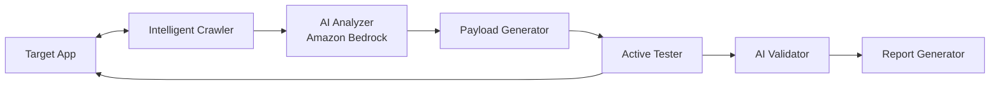

# Diana — AI-Enabled Web Vulnerability Scanner

Diana is an AI-powered web application vulnerability scanner that combines traditional scanning techniques with LLM-driven intelligence. Built on Amazon Bedrock, it uses AI agents to autonomously discover, analyze, and validate security vulnerabilities with significantly reduced false positives.

## Why Diana?

Traditional web scanners blast targets with static payloads and pattern-match responses. They generate mountains of false positives and miss context-dependent vulnerabilities entirely.

Diana takes a different approach:

- **AI-generated payloads** — crafted for each endpoint's specific context, tech stack, and behavior
- **Semantic validation** — the AI reads and reasons about responses instead of regex matching
- **Attack chain discovery** — identifies multi-step vulnerabilities that signature scanners miss
- **Narrative reporting** — human-readable findings with AI-written remediation guidance

## Quick Start

```bash
# Clone and install
git clone https://github.com/diana-scanner/diana.git
cd diana
python -m venv .venv && source .venv/bin/activate
pip install -e ".[dev]"

# Scan a target (local mode, no AWS required)
diana scan https://target.com --local --modules xss,sqli,headers

# Scan with AI enabled (requires AWS Bedrock access)
DIANA_AI_ENABLED=true diana scan https://target.com -e engagements/local-juiceshop.yaml

# Start API server
diana serve --port 8000
```

## Local Development (No AWS Required)

Diana works without AWS by using [Ollama](https://ollama.ai) for local LLM inference:

```bash
# Start Ollama + test targets
docker compose -f docker-compose.dev.yaml up -d

# Scan Juice Shop locally
diana scan http://localhost:3000 --local --modules xss,sqli,headers
```

## AWS Deployment

For full AI-enabled scanning with Amazon Bedrock, deploy the infrastructure:

### Prerequisites

- AWS account with Bedrock model access (us-east-1 recommended)
- Terraform >= 1.5
- S3 bucket + DynamoDB table for Terraform state

### Setup

```bash
cd tf/environments/dev

# 1. Configure backend — copy the example and fill in your values
cp backend.hcl.example backend.hcl
# Edit backend.hcl with your S3 bucket and region

# 2. Configure variables — copy the example and fill in your values
cp terraform.tfvars.example terraform.tfvars
# Edit terraform.tfvars with your domain, DB password, API key, etc.

# 3. Initialize and deploy
terraform init -backend-config=backend.hcl
terraform apply
```

### Required Configuration (terraform.tfvars)

| Variable | Description | Example |
|----------|-------------|---------|
| `domain_name` | FQDN for Diana API | `diana.example.com` |
| `hosted_zone_id` | Route 53 hosted zone ID | `Z0123456789ABCDEF` |
| `db_password` | RDS master password | (generate a strong password) |
| `api_key` | API authentication key | (generate a strong key) |
| `github_repo_url` | Your fork's URL (for agent team CodeBuild) | `https://github.com/you/diana.git` |

See [terraform.tfvars.example](tf/environments/dev/terraform.tfvars.example) for all options.

## Architecture



See [docs/ARCHITECTURE.md](docs/ARCHITECTURE.md) for the full design.

## Vulnerability Detection

| Category | Modules |
|----------|---------|
| Injection | SQL Injection, XSS, Command Injection, SSTI |
| Access Control | IDOR, Broken Authorization, Path Traversal |
| Misconfiguration | Security Headers, CORS, Debug Endpoints |
| Information Disclosure | Stack Traces, Exposed Secrets, Verbose Errors |
| Cryptographic | Weak TLS, Insecure Cookies, Token Analysis |

## Tech Stack

- **Language:** Python 3.12+
- **AI:** Amazon Bedrock (Claude, DeepSeek) or Ollama (local)
- **HTTP:** HTTPX (async), Playwright (JS-rendered pages)
- **CLI:** Typer
- **API:** FastAPI
- **Data:** SQLAlchemy + PostgreSQL
- **Infra:** Terraform, ECS Fargate, Aurora Serverless

## Documentation

- [Architecture](docs/ARCHITECTURE.md) — system design and component diagrams
- [Getting Started](docs/GETTING_STARTED.md) — installation and usage
- [API Reference](docs/API.md) — REST API documentation
- [Agent Team Plan](docs/AGENT_TEAM_PLAN.md) — autonomous improvement agent design
- [Chronicle](docs/CHRONICLE.md) — iteration history and metrics

## Ethical Use

Diana is designed for **authorized security testing only**. Always obtain written permission before scanning any target. The scanner enforces scope boundaries and provides full audit logging of all requests.

See the engagement configuration files in `engagements/` for how scope constraints are defined and enforced.

## License

Apache 2.0 — see [LICENSE](LICENSE) for details.
