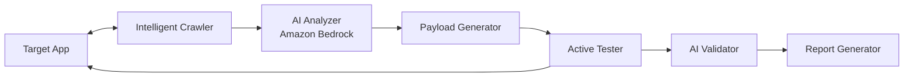

# Diana — AI-Enabled Web Vulnerability Scanner

> **Authorized security testing only.** Diana is a penetration testing tool designed for use with explicit written permission from the target system owner. Unauthorized scanning is illegal and unethical. The scanner enforces scope boundaries, logs all requests, and provides a full audit trail — but the responsibility for authorized use lies with the operator. See [Ethical Use](#ethical-use) for details.

Diana is an AI-powered web application vulnerability scanner that combines traditional scanning techniques with LLM-driven intelligence. Built on Amazon Bedrock, it uses AI agents to autonomously discover, analyze, and validate security vulnerabilities with significantly reduced false positives.

## Why Diana?

Traditional web scanners blast targets with static payloads and pattern-match responses. They generate mountains of false positives and miss context-dependent vulnerabilities entirely.

Diana takes a different approach:

- **AI-generated payloads** — crafted for each endpoint's specific context, tech stack, and behavior
- **Semantic validation** — the AI reads and reasons about responses instead of regex matching
- **Attack chain discovery** — identifies multi-step vulnerabilities that signature scanners miss
- **Narrative reporting** — human-readable findings with AI-written remediation guidance

## Quick Start

```bash
# Clone and install (use your own fork's URL)
git clone https://github.com/YOUR_ORG/diana.git
cd diana
python -m venv .venv && source .venv/bin/activate
pip install -e ".[dev]"

# Scan a target (local mode, no AWS required)
diana scan https://target.com --local --modules xss,sqli,headers

# Scan with AI enabled (requires AWS Bedrock access)
DIANA_AI_ENABLED=true diana scan https://target.com -e engagements/local-juiceshop.yaml

# Start API server
diana serve --port 8000
```

## Local Development (No AWS Required)

Diana works without AWS by using [Ollama](https://ollama.ai) for local LLM inference:

```bash
# Start Ollama + test targets
docker compose -f docker-compose.dev.yaml up -d

# Scan Juice Shop locally
diana scan http://localhost:3000 --local --modules xss,sqli,headers
```

## AWS Deployment

For full AI-enabled scanning with Amazon Bedrock, deploy the infrastructure:

### Prerequisites

- AWS account with **Bedrock model access enabled** in your region (see [Getting Started](docs/GETTING_STARTED.md#aws-configuration) to verify)
- AWS CLI configured with credentials (`aws sts get-caller-identity` should succeed)
- Terraform >= 1.5
- A GitHub fork of this repo you can push to (CodeBuild builds the scanner image from your pushed branches)
- A Route 53 hosted zone + domain, **only if** you want the public Diana API endpoint (the agent workflow does **not** need it — see note below)

### Setup

**0. Bootstrap the Terraform state backend** (one-time, per account). The S3 state bucket and DynamoDB lock table must exist *before* `terraform init` — Terraform can't create its own backend:

```bash
ACCOUNT_ID=$(aws sts get-caller-identity --query Account --output text)
aws s3api create-bucket --bucket "diana-terraform-state-$ACCOUNT_ID" --region us-east-1
aws s3api put-bucket-versioning --bucket "diana-terraform-state-$ACCOUNT_ID" \
  --versioning-configuration Status=Enabled
aws dynamodb create-table --table-name diana-terraform-locks \
  --attribute-definitions AttributeName=LockID,AttributeType=S \
  --key-schema AttributeName=LockID,KeyType=HASH \
  --billing-mode PAY_PER_REQUEST --region us-east-1
```

**1. Authorize CodeBuild to pull from your GitHub repo** (one-time, per account). CodeBuild's source is your GitHub repo, so it needs a credential. Create a GitHub [personal access token](https://github.com/settings/tokens) with `repo` scope, then import it:

```bash
aws codebuild import-source-credentials --region us-east-1 \
  --server-type GITHUB --auth-type PERSONAL_ACCESS_TOKEN --token "ghp_your_token"
```

> Without this, **every CodeBuild build fails** and no scan (manual or agent) can run — the whole pipeline builds the image from your branch. (Alternatively, manage this in Terraform by adding an `aws_codebuild_source_credential` resource.)

**2. Configure the backend and variables** — copy the examples and fill in your values:

```bash
cd tf/environments/dev
cp backend.hcl.example backend.hcl          # set bucket to diana-terraform-state-<your-account-id>
cp terraform.tfvars.example terraform.tfvars # set github_repo_url to YOUR fork, DB password, api_key, etc.
```

**3. Initialize and deploy:**

```bash
terraform init -backend-config=backend.hcl
terraform apply
```

### Required Configuration (terraform.tfvars)

| Variable | Description | Example |
|----------|-------------|---------|
| `domain_name` | FQDN for Diana API | `diana.example.com` |
| `hosted_zone_id` | Route 53 hosted zone ID | `Z0123456789ABCDEF` |
| `db_password` | RDS master password | (generate a strong password) |
| `api_key` | API authentication key | (generate a strong key) |
| `github_repo_url` | Your fork's URL (for agent team CodeBuild) | `https://github.com/you/diana.git` |

See [terraform.tfvars.example](tf/environments/dev/terraform.tfvars.example) for all options.

> **`domain_name` / `hosted_zone_id`** provision the public Diana API endpoint (ALB + ACM cert). The **autonomous agent workflow does not use them** — each scan task runs its own Juice Shop sidecar at `localhost:3000`. If you only want the agent loop, you still need to set them today (they have no defaults); point them at any hosted zone you control, or edit the module to make the API endpoint optional.

> **Model selection.** The scanner's built-in default is `deepseek.v3.2` (cheapest on Bedrock). The Terraform-deployed scanner uses `bedrock_model_id` (default `anthropic.claude-sonnet-4-6`). Set it to **any Bedrock model you have access-enabled** in your region — mismatched or un-enabled model IDs are the most common first-run failure.

### Cost Warning

Running Diana on AWS incurs real costs that can accumulate quickly. AI-enabled scans make many LLM calls through Bedrock, the agent team runs multiple scans per iteration on ECS Fargate, and infrastructure resources (Aurora, ElastiCache, NAT Gateway) have standing charges while deployed.

**Strategies this project uses to manage costs:**

- **DeepSeek V3.2 as the default model** — significantly cheaper per token than Claude on Bedrock, with acceptable scan quality
- **Ollama for local development** — zero AWS cost for iterating on scanner logic before deploying
- **Fargate for agent tasks** — pay-per-task, no idle compute. Tasks spin up, run, and terminate
- **Generality gate before AWS spend** — the agent team catches bad code locally before launching any ECS tasks
- **Per-module token tracking** — the `ModuleMetrics` table records LLM calls and token counts per scan per module, so you can identify which components consume the most
- **Bedrock pricing config** — `scripts/bedrock-pricing.json` feeds cost estimates into the chronicle for per-iteration tracking
- **Tear down when not in use** — `terraform destroy` removes all infrastructure. Redeploy with `terraform apply` when you're ready to work again

Monitor your AWS billing dashboard closely, especially during early experimentation. Set up a billing alarm before your first deployment.

## Architecture


```mermaid
graph LR
    Target[Target App] <--> Crawler[Intelligent Crawler]
    Crawler --> AI[AI Analyzer<br/>Amazon Bedrock]
    AI --> PayloadGen[Payload Generator]
    PayloadGen --> Tester[Active Tester]
    Tester --> Target
    Tester --> Validator[AI Validator]
    Validator --> Report[Report Generator]
```

See [docs/ARCHITECTURE.md](docs/ARCHITECTURE.md) for the full design.

## Vulnerability Detection

| Category | Modules |
|----------|---------|
| Injection | SQL Injection, XSS, Command Injection, SSTI |
| Access Control | IDOR, Broken Authorization, Path Traversal |
| Misconfiguration | Security Headers, CORS, Debug Endpoints |
| Information Disclosure | Stack Traces, Exposed Secrets, Verbose Errors |
| Cryptographic | Weak TLS, Insecure Cookies, Token Analysis |

## Tech Stack

- **Language:** Python 3.12+
- **AI:** Amazon Bedrock (Claude, DeepSeek) or Ollama (local)
- **HTTP:** HTTPX (async), Playwright (JS-rendered pages)
- **CLI:** Typer
- **API:** FastAPI
- **Data:** SQLAlchemy + PostgreSQL
- **Infra:** Terraform, ECS Fargate, Aurora Serverless

## Autonomous Agent Team

Diana is also a proof of concept in **agentic software development** — a team of AI agents that iteratively improve the scanner's detection capabilities without human intervention (beyond final merge approval).

The agent team runs a continuous improvement loop: scan a target, measure detection coverage, identify gaps, implement a fix, validate the fix didn't break anything or introduce target-specific code, and record the results. Each agent's work is validated by a different agent — no agent marks its own homework.

### The Loop

```
1. BASELINE         Validation Agent scans a target on AWS, records solve rate
2. GAP ANALYSIS     Improvement Agent reads results, picks highest-impact generic fix
3. IMPLEMENT        Improvement Agent writes code on a feature branch
4. GENERALITY GATE  Generality Agent reviews diff — rejects target-specific code
5. TEST AUTHORING   Test Author writes tests, Test Critic reviews them
6. AWS VALIDATION   Validation Agent runs a full fresh-crawl scan on ECS
7. REVIEW           Review Agent synthesizes all results, recommends merge or reject
8. CHRONICLE        Review Agent records metrics, narrative, and next steps
```

> **Autonomous mode:** the steps above are the manual/interactive loop. For a
> hands-off run toward a solve-rate % target, the `juiceshop-solve-loop` workflow
> parallelizes K module auditors per round, integrates, full-scans, auto-merges,
> and repeats. It runs via the **Claude Code Workflow tool** (not a shell command)
> and needs AWS infra up + CodeBuild authorized first — see
> [docs/AGENTIC_SDLC.md § Running it](docs/AGENTIC_SDLC.md#running-it).

### The Agents

| Agent | Runs | Responsibility |
|-------|------|----------------|
| **Validation** | AWS (ECS) | Run Diana against test targets, compare results to known vulnerabilities, produce gap analysis |
| **Improvement** | Local | Read gap analysis, select highest-impact generic improvement, implement on feature branch |
| **Generality** | Local | Review every changed line — reject code that only works against one target or tech stack |
| **Test Author** | Local | Write unit tests for new/changed code with synthetic fixtures (no live targets) |
| **Test Critic** | Local | Review tests for correctness, completeness, and independence — reject vacuous tests |
| **Tiny-loop** | AWS (ECS) | Fast single-module scan on a cached crawl for inner-loop iteration |
| **Review** | Local | Final quality gate — synthesize all agent verdicts, write chronicle entry, recommend merge/reject |
| **Orchestrator** | Local | Run the full loop, enforce gate ordering, detect stalls |

### Cross-Validation

Every agent that produces output has a different agent that validates it:

| Producer | Validator |
|----------|-----------|
| Improvement Agent | Generality, Test Critic, Validation |
| Test Author | Test Critic |
| Validation Agent | Review Agent |
| Review Agent | Human (the only output you need to check) |

### AWS Infrastructure

Agent tasks run on ECS Fargate with isolated Juice Shop sidecar containers. CodeBuild builds a Diana image from the feature branch, pushes to ECR, and ECS runs the scan. Results land in S3 as structured JSON, fetched by local agents for analysis.

The agent skills are defined in `.claude/skills/agent-*/SKILL.md` and invocable as Claude Code slash commands (`/agent-validation`, `/agent-orchestrator`, etc.).

See [docs/AGENT_TEAM_PLAN.md](docs/AGENT_TEAM_PLAN.md) for the full design and [docs/CHRONICLE.md](docs/CHRONICLE.md) for iteration history.

## Documentation

- [Architecture](docs/ARCHITECTURE.md) — system design and component diagrams
- [Getting Started](docs/GETTING_STARTED.md) — installation and usage
- [API Reference](docs/API.md) — REST API documentation
- [Agent Team Plan](docs/AGENT_TEAM_PLAN.md) — autonomous improvement agent design
- [Chronicle](docs/CHRONICLE.md) — iteration history and metrics
- [RAG Optimization](docs/FUTURE_RAG_OPTIMIZATION.md) — future context optimization design

## Ethical Use

Diana is designed for **authorized security testing only**. Always obtain written permission before scanning any target. The scanner enforces scope boundaries and provides full audit logging of all requests.

See the engagement configuration files in `engagements/` for how scope constraints are defined and enforced.

## License

Apache 2.0 — see [LICENSE](LICENSE) for details.
