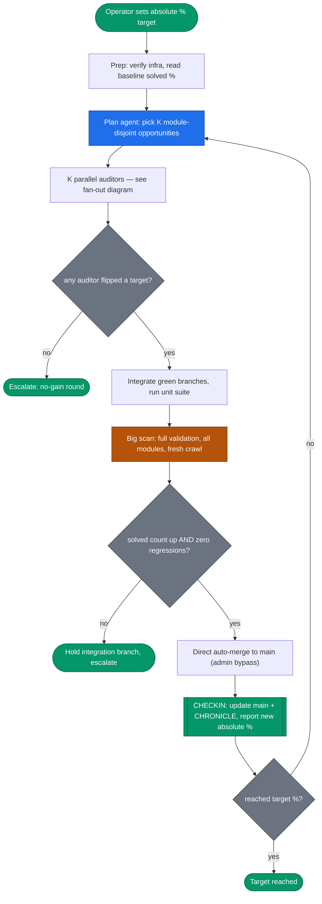
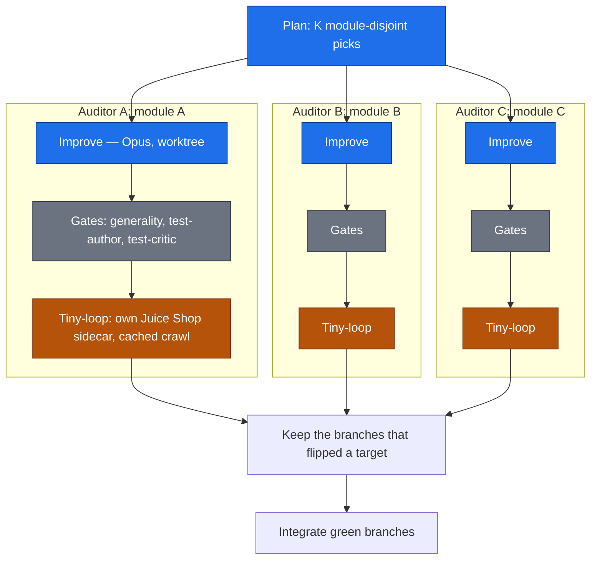

# Agentic SDLC — Autonomous Parallel-Auditor Solve Loop

Diana drives itself toward an **absolute** Juice Shop solve-rate % target
(`solved / 113`) with limited human oversight. Work is done by parallel auditor
subagents, one per scanner module, each validated in its own isolated AWS
sandbox, then integrated and full-scanned before landing on `main`.

**Inter-agent communication is via shared repo state, not direct messaging.**
Agents read `main`, `docs/CHRONICLE.md`, and the newest `gap-analysis.md`; a
**checkin** is the moment that shared state updates (a round's merged changes +
new chronicle entry). The next round's agents plan against that fresh state — so
the checkin is both the operator's visibility point *and* how one round's work is
communicated to the next.

Implemented as `.claude/workflows/juiceshop-solve-loop.js`.

## Round lifecycle

One round runs autonomously; the operator is touched only at the checkin (and on
escalation). The loop repeats until the absolute % target is reached.



## Auditor fan-out (inside one round)

K auditors run in parallel, one scanner module each, worktree-isolated so their
edits never collide. Each ECS tiny-loop carries its **own Juice Shop sidecar**,
so parallel scans cannot contaminate each other's scoreboard.



## What runs where

| Stage | Runs as | Where | Model |
|---|---|---|---|
| Plan | subagent | local | inherit |
| Improve (xK) | subagents, **worktree-isolated**, parallel | local git | Opus |
| Gates (xK) | `agent-generality` / `agent-test-author` / `agent-test-critic` | local | Sonnet |
| Tiny-loop (xK) | `agent-tinyloop`, parallel | **AWS** — each its own Juice Shop sidecar | Haiku |
| Integrate | subagent | local git | inherit |
| Big scan | `agent-validation` | **AWS** — full fresh-crawl scan | Haiku |
| Land + checkin | subagent | git to `main` | inherit |

## Why the parallelism is safe (no shared-target contamination)

Each ECS scan task bundles **its own Juice Shop container** at `localhost:3000`
(`tf/modules/agent_infra/main.tf` — `diana-scanner` + `juice-shop` sidecar). So
K parallel tiny-loops = K independent Juice Shops + K independent scoreboards.
No cross-auditor state pollution, no scoreboard races. CodeBuild Linux/Small
concurrency is already 15, so K = 2 to 3 needs no infra change.

## Guardrails (limited human oversight)

- **Module-disjoint auditors** — no two edit the same scanner file (clean merges,
  clean attribution).
- **Crawler-set changes are disqualified** from the fast tiny-loop
  (`crawler.py` / `spa_crawler.py` / `models.py`) — they force a dedicated full
  scan, so they cannot ride the parallel round.
- **Merge gate** — a round lands on `main` only if the full scan's absolute
  solved count **rose with zero regressions**.
- **Bounded run** — one workflow run executes **up to 5 rounds**, stopping early
  only when the absolute % target is reached (or the token budget runs low). A
  no-gain round doesn't merge (the gate blocks it) but the run continues to try
  fresh opportunities next round, up to the cap.
- **Absolute % target** — expressed as `solved / 113` (today: 19/113 = 16.8%).

## Landing on `main`

**Direct auto-merge (resolved).** `main` is branch-protected (1 review required),
but the loop runs under admin credentials that bypass it. Each improving round
merges straight to `main` with `--no-ff`, appends a `CHRONICLE.md` entry, and
continues on the fresh state — fully hands-off. The chronicle entry + per-round
log line are the checkin (watch live via `/workflows`).

The merge **gate** still holds: a round merges only if the full scan's absolute
solved count rose with zero regressions. So "auto-merge" never means "merge
anything" — it means "merge a verified improvement without waiting for a human."

## Running it

```
Workflow({ name: 'juiceshop-solve-loop', args: { targetPct: 25 } })
```

- `targetPct` (required) — absolute solve-rate % to reach (e.g. 25 = 25% of 113).
- `auditorsPerRound` (default 3), `maxRounds` (default 5), `modules` (optional
  module allow-list), `dryRoundLimit` (default = maxRounds; set lower to stop
  after N consecutive no-gain rounds).

Requires AWS infra up first (the run aborts cleanly if it isn't).
