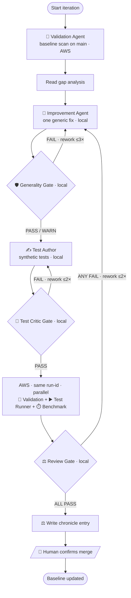
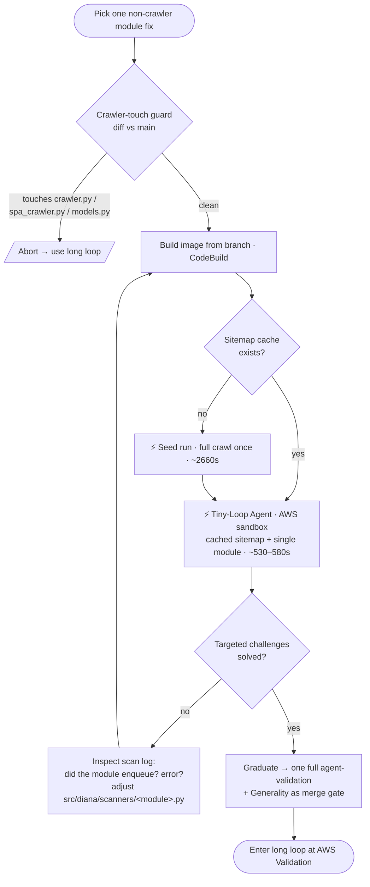

# The Agentic Developer Loops

How Diana's autonomous agent team actually iterates — the **long loop** (full
validation-to-merge) and the **short loop** (the tiny loop), why each exists,
and the personas that run them.

> Companion docs: [AGENT_TEAM_PLAN.md](AGENT_TEAM_PLAN.md) (design),
> [CHRONICLE.md](CHRONICLE.md) (iteration history). This doc is about the
> *process* — the loops and the agents that walk them.

---

## Why two loops

A single principle drives the whole system: **no agent marks its own homework.**
Every agent that produces something is checked by a *different* agent. That
cross-validation is what makes autonomous iteration trustworthy — but it is also
expensive. The two loops are two different answers to "how much ceremony does
*this* change deserve."

| | **Long loop** | **Short loop (tiny loop)** |
|---|---|---|
| Purpose | Prove a change is correct, generic, and safe to merge | Converge a single module's logic fast |
| Crawl | Fresh full crawl every run | Reuses a cached sitemap |
| Modules | Full suite | Only the module under test |
| Where | Local gates + AWS (ECS) | AWS sandbox (lighter) |
| Wall-clock | ~30–60 min / iteration | seed run ~2660s, then **~530–580s (4.5× faster)** |
| Role | The **merge gate** | The **inner loop** before the gate |
| Introduced | Iteration 0 | Iteration 4 |

The rule of thumb: **iterate on the short loop, graduate to the long loop.**

---

## Evolution

### Phase 1 — the long loop only (Iterations 0–3)

The project started with the full team loop: baseline scan → improvement →
generality gate → tests → parallel AWS validation/test-runner/benchmark → review
→ chronicle. This is the loop that establishes trust: cross-validated at every
hop, merge-gated by a human-checked Review Agent.

It worked — Iteration 3 landed the first real solve-rate gain (Playwright SPA
crawling, +0.9%). But it was *heavy*: every attempt, even a one-line tweak to a
single scanner, paid for a fresh full crawl (~25 min of Playwright rendering)
plus the entire module suite plus the AI validator — roughly 30–60 minutes and
real Bedrock spend per turn of the crank. Converging a fiddly single-module fix
through this loop was painfully slow.

### Phase 2 — the tiny loop emerges (Iteration 4)

Iteration 4 (`access_control`) needed *many* small iterations to debug one
module end-to-end — exactly the case the long loop punishes. So the **tiny loop**
was built: a lean inner loop that

- **reuses a cached sitemap** (`--sitemap-cache`), skipping the expensive crawl;
- **runs only the module under test**, not the full suite;
- **asserts against the live Juice Shop scoreboard** for the targeted challenges.

It runs in the *same* AWS sandbox as validation, reusing the validation task
definition with the entrypoint swapped via an env var (`AGENT_ENTRYPOINT`) — no
Terraform change. The first run for a given crawler version seeds the shared
cache (~2660s); every run after reuses it (~530–580s). That 4.5× speedup made a
four-blocker debug session affordable in an afternoon.

The tiny loop has one hard guard: it is **only sound when the change does not
touch the crawler** (`crawler.py`, `spa_crawler.py`, `models.py`). A stale
cached sitemap would mask crawler regressions, so the skill aborts to the long
loop if the diff touches that set.

### The synthesis (current practice)

The two loops are now used together: **converge** a non-crawler module fix on the
tiny loop, then run **one** full long-loop validation as the merge gate. The
short loop is for *speed*; the long loop is for *trust*. (Iteration 5's
input-validation work touches the crawler, so it skips the tiny loop and goes
straight to the long loop — the guard in action.)

---

## The personas

Each agent is a single-responsibility persona with a habitat (local or AWS) and,
crucially, a thing it will **refuse**.

### Long-loop cast

**🎛️ Orchestrator** — *the conductor.* Runs the full loop, enforces gate
ordering, manages the shared run-id, and watches for stalls (no improvement in 2
iterations, same idea tried 3×, cost past $50 without gain → escalate to human).
It coordinates but **refuses to make implementation decisions** — that's the
Improvement Agent's job. *Habitat: local.*

**🔬 Validation Agent** — *the field examiner.* Builds a Diana image from the
branch, runs it against a real target on ECS, compares findings to known
vulnerabilities, and writes the **gap analysis** that drives the next move. The
source of ground truth. *Habitat: AWS (ECS).*

**🔧 Improvement Agent** — *the engineer.* Reads the gap analysis, picks the
**single highest-impact _generic_ fix**, and implements it on a feature branch.
Disciplined to one improvement per iteration. **Refuses** scope creep. *Habitat:
local.*

**🛡️ Generality Agent** — *the purist gatekeeper.* Reviews every changed line and
rejects anything that only works against one target or tech stack — target
names, challenge-aware code, hardcoded responses, path assumptions. Its creed:
*"If the improvement wouldn't also help scan a Django app, a Spring Boot API, and
a Rails monolith, it fails review."* Juice Shop is the benchmark, not the target.
A hard FAIL blocks the pipeline. *Habitat: local.*

**✍️ Test Author** — *the QA writer.* Writes unit tests for the new code using
**synthetic fixtures** — no live target, no captured responses. **Refuses** tests
that need a target running. *Habitat: local.*

**🧪 Test Critic** — *the skeptic.* Reviews the tests for correctness,
completeness, and independence; **rejects vacuous or target-specific tests** (a
test that would pass against any code, or only against Juice Shop). A FAIL sends
the Test Author back. *Habitat: local.*

**▶️ Test Runner** — *the CI.* Executes the pytest suite on the branch on ECS and
reports pass/fail. No opinions, just results. *Habitat: AWS (ECS).*

**⏱️ Benchmark Agent** — *the stopwatch & accountant.* A timed scan measuring
duration, token usage, and HTTP request count, so regressions in speed or cost
are caught before merge. *Habitat: AWS (ECS).*

**⚖️ Review Agent** — *the judge & chronicler.* Synthesizes every verdict against
the merge criteria (solve rate up, no test regressions, performance acceptable,
generality PASS/WARN, tests sound), recommends **merge or reject**, and writes
the chronicle entry — the project's institutional memory. **The only agent whose
output the human must check**, and it **waits for human confirmation before
merging.** *Habitat: local.*

### Short-loop cast

**⚡ Tiny-Loop Agent** — *the inner-loop mechanic.* A lean alternative to the
Validation Agent for converging one module: cached crawl, single module, asserts
the scoreboard for the targeted challenges — minutes, not ~50 of them. **Refuses
to run when the diff touches the crawler** (the cached sitemap would lie) and
sends you to the long loop instead. It is a *measurement* tool, not a merge gate:
its fix still has to clear Generality and a full validation before it lands.
*Habitat: AWS sandbox (lighter).*

### Cross-validation matrix

No agent validates its own output:

| Producer | Validated by |
|---|---|
| Improvement Agent | Generality, Test Critic, Validation, Benchmark |
| Test Author | Test Critic |
| Validation Agent | Review Agent |
| Benchmark Agent | Review Agent |
| Tiny-Loop Agent | (measurement only) Generality + full Validation before merge |
| Review Agent | **Human** |

---

## The long loop

## The short loop (tiny loop)

---

## In one sentence

The **short loop** answers *"is this module doing the thing yet?"* in minutes;
the **long loop** answers *"is this change correct, generic, fast, and safe to
merge?"* — and only a human, reading the Review Agent, closes it.
