# AI-Enabled Web Scanner — Architecture

## Overview

**Diana** is an AI-powered web application vulnerability scanner that uses LLM agents to autonomously discover, test, and validate security vulnerabilities. Built on **LangChain + LangGraph** with **Amazon Bedrock** (provider-swappable to Ollama/HuggingFace), deployed on AWS ECS Fargate.

Diana uses AI at three levels:
1. **Tool-using agents (LangGraph ReAct)** — four specialized agents (access control, SQLi, XSS, discovery) get HTTP request tools and autonomously reason about multi-step attack flows without any hardcoded application-specific logic
2. **Context-aware generation** — AI crafts payloads and hypotheses tailored to the target's tech stack, then validates findings semantically to reject false positives
3. **Scan configuration** — AI auto-discovers login flows, crawl traps, and session handling during the pre-scan phase

Agents coordinate via a **shared PostgreSQL database** — each agent pulls batched endpoints (not the full sitemap), writes findings visible to other agents, and receives prior findings as context. This reduces LLM context bloat, prevents hallucinations, and enables horizontal scaling.

---

## Engagement Layer

The Engagement Layer is the **authority boundary** for every scan. It is the outermost enforcement layer — nothing gets crawled, tested, or reported unless the engagement configuration explicitly permits it. Every component in the system checks scope against the engagement before taking action.

```mermaid
flowchart TD
    subgraph Engagement Configuration
        EngCfg[engagement.yaml]
    end

    subgraph Engagement Enforcer
        ScopeCheck{In Scope?}
        DomainVal[Domain Validator]
        PathVal[Path Validator]
        MethodVal[Method Validator]
        PortVal[Port Validator]
        TimeWindow[Time Window Check]
        RateGov[Rate Governor]
    end

    subgraph Protected Components
        Crawler[Crawler]
        Scanner[Scanner Modules]
        PayloadGen[Payload Generator]
        HTTPClient[HTTP Client]
    end

    EngCfg --> ScopeCheck
    ScopeCheck -->|Yes| Protected Components
    ScopeCheck -->|No| Deny([DENY + Log Violation])

    ScopeCheck --> DomainVal
    ScopeCheck --> PathVal
    ScopeCheck --> MethodVal
    ScopeCheck --> PortVal
    ScopeCheck --> TimeWindow
    ScopeCheck --> RateGov

    Crawler --> ScopeCheck
    Scanner --> ScopeCheck
    PayloadGen --> ScopeCheck
    HTTPClient --> ScopeCheck

    style Deny fill:#8b0000,stroke:#e94560,color:#fff
    style ScopeCheck fill:#2d6a4f,stroke:#40916c,color:#fff
    style EngCfg fill:#0f3460,stroke:#e94560,color:#fff
```

### Engagement Configuration

```yaml
# engagement.yaml — the single source of truth for scan authorization
engagement:
  id: "ENG-2026-0042"
  client: "Acme Corp"
  start_date: "2026-05-07T00:00:00Z"
  end_date: "2026-05-21T23:59:59Z"
  tester: "your-name"

scope:
  # Explicitly allowed targets — everything else is DENIED
  targets:
    - domain: "app.acme.com"
      ports: [443]
      paths:
        include:
          - "/*"
        exclude:
          - "/admin/delete*"
          - "/api/v1/billing/*"
      methods: [GET, POST, PUT, DELETE]

    - domain: "api.acme.com"
      ports: [443]
      paths:
        include:
          - "/api/v2/*"
        exclude: []
      methods: [GET, POST]

  # Hard deny list — these are NEVER touched regardless of other rules
  deny_list:
    - "*.acme-production.com"
    - "payments.acme.com"
    - "10.0.0.0/8"

restrictions:
  rate_limit: 20              # max requests/second
  max_concurrent: 5           # max parallel connections
  time_window:                # only scan during approved hours
    timezone: "America/Denver"
    allowed_hours: "22:00-06:00"  # off-peak only
    allowed_days: ["mon", "tue", "wed", "thu", "fri"]
  destructive_payloads: false # no DROP TABLE, no file writes
  max_crawl_depth: 5

notifications:
  on_scope_violation: "warn_and_block"  # warn_and_block | block_silent | warn_only
  webhook: "https://hooks.slack.com/services/T.../B.../xxx"
```

### Defense in Depth — Multi-Layer Enforcement

The engagement scope is not enforced at a single point. It is applied as **defense in depth** across every layer of the stack, so that even if one layer has a bug or is bypassed, out-of-scope traffic **cannot leave the system**.

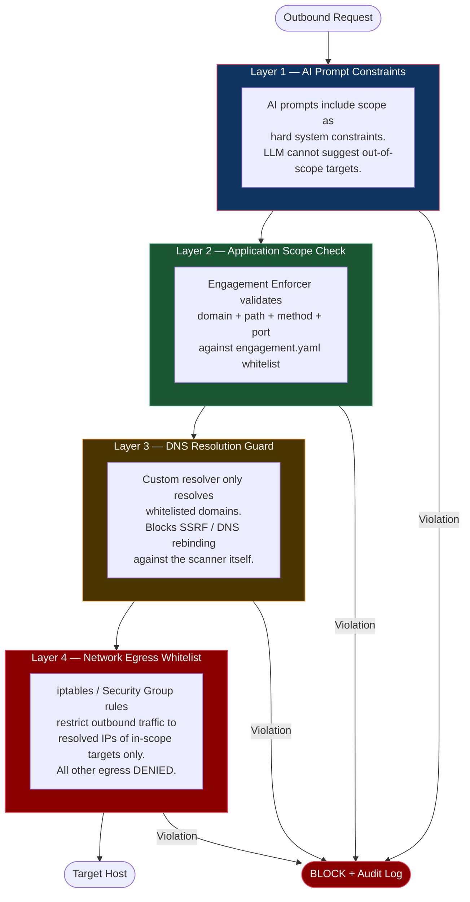

| Layer | What It Enforces | Failure Mode |
|-------|-----------------|--------------|
| **L1 — AI Prompt Constraints** | LLM system prompts include the engagement scope as immutable context. The AI cannot reason about or suggest targets outside scope. | If the LLM hallucinates an out-of-scope target, L2 catches it. |
| **L2 — Application Scope Check** | The `EngagementEnforcer` wraps the HTTP client. Every URL is validated against the `engagement.yaml` whitelist before any request is constructed. | If a code bug bypasses the enforcer, L3 catches it. |
| **L3 — DNS Resolution Guard** | A custom DNS resolver only resolves domains explicitly listed in `scope.targets[].domain`. All other lookups return NXDOMAIN. Also prevents DNS rebinding attacks against the scanner itself. | If DNS is somehow bypassed, L4 catches it. |
| **L4 — Network Egress Whitelist** | At container startup, `iptables` rules (or AWS Security Group rules in cloud mode) are generated from the engagement config. Only the resolved IPs of in-scope targets on allowed ports are permitted. **All other outbound traffic is dropped.** | Hard network boundary. Cannot be bypassed from application code. |

### Engagement Enforcer (Application Layer Detail)

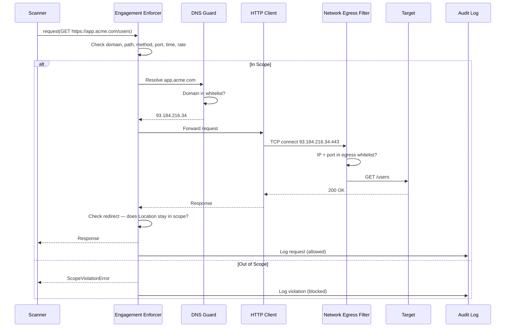

### Engagement Rules

| Rule | Behavior |
|------|----------|
| **Domain not in whitelist** | Blocked at L2 (enforcer) and L3 (DNS) and L4 (network) |
| **Path excluded** | Blocked at L2, logged |
| **Redirect leaves scope** | Redirect not followed, logged as info finding |
| **Outside time window** | Scan paused automatically, resumes when window opens |
| **Rate limit exceeded** | Request queued, backpressure applied |
| **Deny list match** | Hard block at all layers — no exceptions |
| **Engagement expired** | Scan cannot start or continue |
| **Destructive payload attempted** | Blocked if `destructive_payloads: false` |
| **DNS rebinding attempt** | Blocked at L3 — re-resolved IPs checked against original |

---

## AI-Driven Scan Configuration

Before the full scan begins, Diana runs a **pre-scan intelligence phase** where the AI analyzes the target and generates scan configuration automatically. This replaces the hours of manual setup traditionally required.

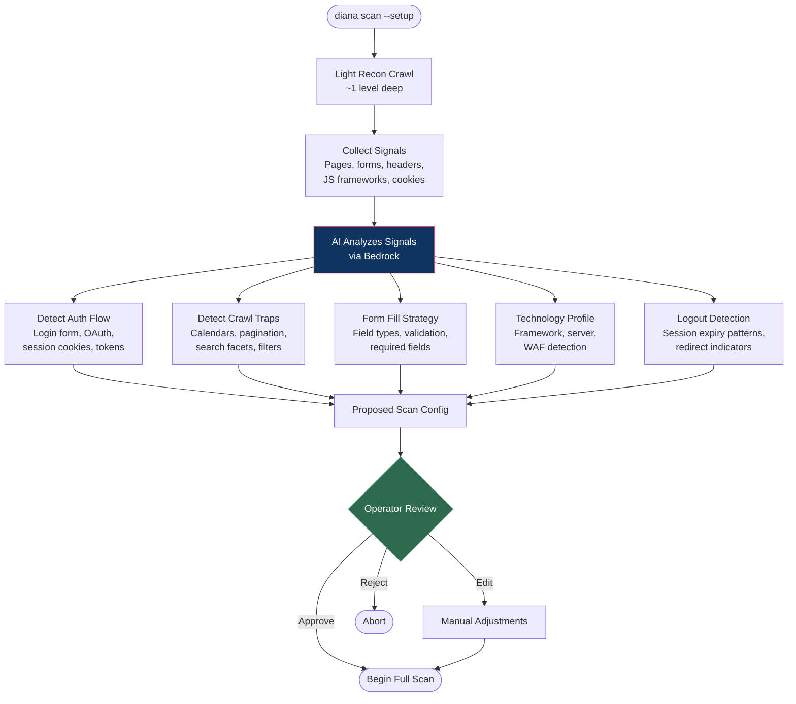

### What the AI Configurator Detects

| Detection | How It Works | Output |
|-----------|-------------|--------|
| **Login flow** | AI reads form fields, action URLs, identifies login patterns (form POST, OAuth redirect, SAML) | Auth config: URL, method, field mapping, credential placeholders |
| **Logout indicators** | AI identifies redirect-to-login patterns, "session expired" text, 401/403 shifts | Regex + semantic rules for session loss detection |
| **Crawl traps** | AI recognizes date pickers, infinite pagination, calendar widgets, filter combos | Auto-generated exclusion patterns |
| **Session management** | AI identifies session cookies, CSRF tokens, JWT refresh patterns | Session handling rules, token refresh config |
| **Form filling** | AI reads field labels, types, validation attributes, placeholders | Per-form fill strategy with contextual test data |
| **Technology stack** | AI analyzes headers, JS bundles, error pages, meta tags | Scanner module selection tuned to the stack |
| **WAF detection** | AI identifies WAF signatures in responses (Cloudflare, AWS WAF, Akamai) | Payload encoding/evasion strategy |

### Mid-Scan Session Monitoring

The AI doesn't just configure and walk away — it monitors session health during the scan:

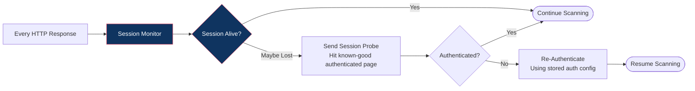

---

## High-Level System Architecture

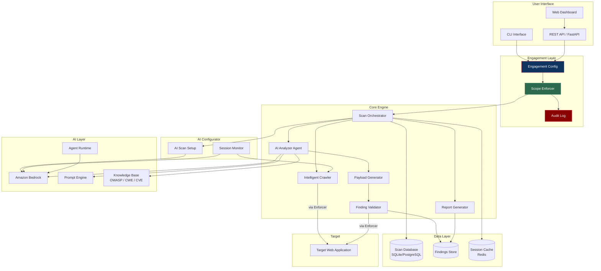

---

## Scanning Pipeline

The scanner operates as a queue-driven pipeline. The orchestrator crawls, dispatches endpoints to per-module queues, then each module pulls and processes its own work.

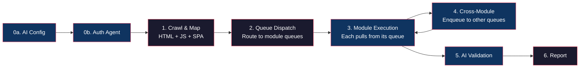

### Phase Details

| Phase | What Happens |
|-------|-------------|
| 0a. AI Config | Light recon, detect auth flows, crawl traps, WAF |
| 0b. Auth Agent | Discover login, authenticate high-priv + low-priv, store tokens in DB |
| 1. Crawl & Map | HTML spider, JS bundle analysis, SPA route discovery (Playwright), IDOR variant generation |
| 2. Queue Dispatch | Orchestrator routes endpoints to per-module queues based on relevance (params → sqli/xss, IDs → auth, base URL → headers/discovery) |
| 3. Module Execution | Each module calls `claim_work()`, processes items, calls `complete_work()`. AI agents use LangGraph ReAct loop. Static modules use payloads + pattern matching. |
| 4. Cross-Module Enqueue | Any module can `enqueue_to()` any other module — sqli finds injection → enqueues to access_control for IDOR check; discovery finds /ftp → enqueues to sqli and xss |
| 5. AI Validation | Each finding checked by LLM for false positive rejection |
| 6. Report | HTML/JSON/SARIF with AI-written narratives. Token usage summary printed. |

No module receives the sitemap. The queue is the interface between the crawler and the modules, and between modules themselves.

---

## AI Agent Architecture

Diana supports two scanning modes — **isolated agents** (simpler, current default) and **graph of thought** (agents coordinate and chain attacks).

### Graph of Thought Scanner (LangGraph StateGraph)

The graph of thought architecture connects agents as nodes in a directed graph. Findings from one agent become input to the next. New endpoints discovered by any agent feed back for another round.

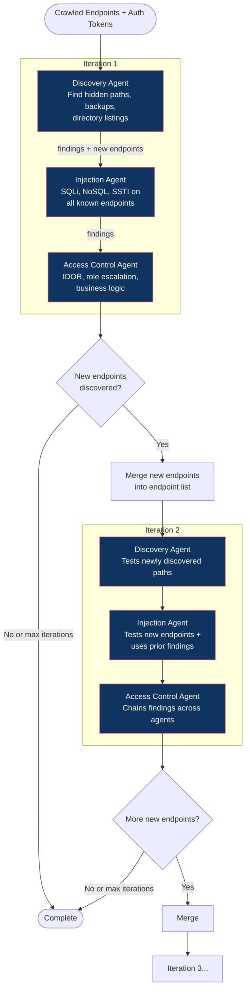

**How agents chain attacks:**

```
Discovery: "Found /ftp directory listing with backup.sql"
    ↓ (finding passed to injection agent)
Injection: "backup.sql shows SQLite schema — trying UNION with 9 columns on search"
    ↓ (finding passed to access control agent)
Access Control: "SQLi dumps user table — checking if those passwords work for login"
    ↓ (new endpoint discovered)
Discovery (iteration 2): "Login as admin found /administration panel — exploring it"
```

Each agent's prompt includes the findings from all prior agents:
```
Findings from other agents:
  [critical] UNION SQLi on /rest/products/search
  [high] /ftp directory listing exposed
  [high] FTP contains backup.sql with schema info
```

### Agent Tools

All agents share the same LangChain tools with engagement scope enforcement:

| Tool | Purpose | Scope Enforced |
|------|---------|:--------------:|
| `http_request` | Make HTTP requests with admin/user/no auth | Yes (L1 + L2) |
| `report_finding` | Report a confirmed vulnerability | N/A |
| `report_new_endpoint` | Feed newly discovered paths back to other agents | N/A |

### Isolated Agents (Fallback Mode)

When running without the graph, each agent runs independently via `ToolUsingAgent` (LangGraph `create_react_agent`). They still share findings via the PostgreSQL database, but don't loop back for additional iterations.

### Scope Enforcement on AI Tool Calls

Every HTTP request any agent makes goes through the engagement enforcer:

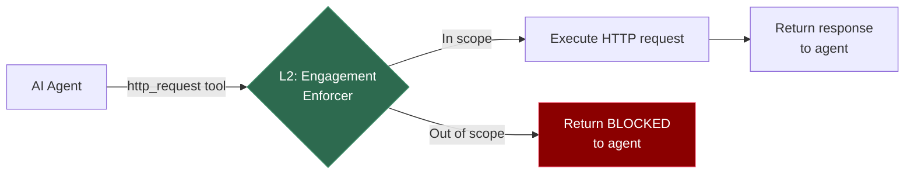

All four enforcement layers apply:
- **L1** — Engagement scope injected into every agent's system prompt
- **L2** — `enforcer.check_request()` on every tool call
- **L3** — DNS guard validates domain resolution
- **L4** — Network egress rules (AWS deployment)

### LLM Provider Abstraction

The graph and all agents use LangChain's `BaseChatModel` interface. Swap providers by changing one function in `llm.py`:

| Provider | Model | Cost | Status |
|----------|-------|------|--------|
| Bedrock (Claude Sonnet 4.6) | `us.anthropic.claude-sonnet-4-6` | ~$3/$15 per 1M tokens | Tested, best quality |
| Bedrock (DeepSeek V3.2) | `deepseek.v3.2` | ~$0.62/$1.85 per 1M tokens | Tested, 6x cheaper |
| Ollama (local) | Any | Free | Supported, not tested |

### Surface Analysis + Validation

These use simpler invoke patterns (not tool-using agents):
- **Surface analysis** — receives crawled sitemap, generates vulnerability hypotheses
- **AI validation** — each raw finding checked semantically for false positive rejection

---

## Auth Agent Architecture

The Auth Agent automatically discovers login flows and captures sessions for authenticated scanning. It cascades through three strategies, using the first that succeeds.

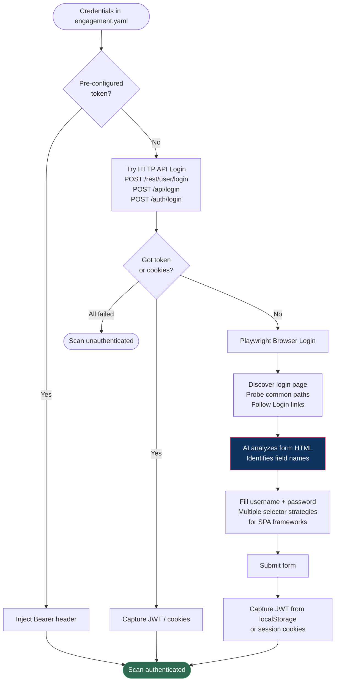

### Playwright Field Filling Strategy

SPA frameworks (Angular Material, React MUI, etc.) hide native `<input>` elements behind wrapper components. The auth agent uses a cascading selector strategy:

| Strategy | Selector | Handles |
|----------|----------|---------|
| 1. Direct name/id | `input[name="email"]:visible` | Standard HTML forms |
| 2. Aria/placeholder | `input[aria-label*="email"]:visible` | Accessible SPAs |
| 3. Input type | `input[type="password"]:visible` | Universal fallback |
| 4. Material wrapper | `mat-form-field input:visible` | Angular Material |
| 5. Keyboard fallback | Click first visible input, `keyboard.type()` | Last resort |

---

## Database-Backed Scan State

All scan coordination flows through PostgreSQL — module work queues, endpoint tracking, findings, auth tokens, and token usage. No module receives the sitemap directly. Every module pulls work from its queue and writes results back to the DB.

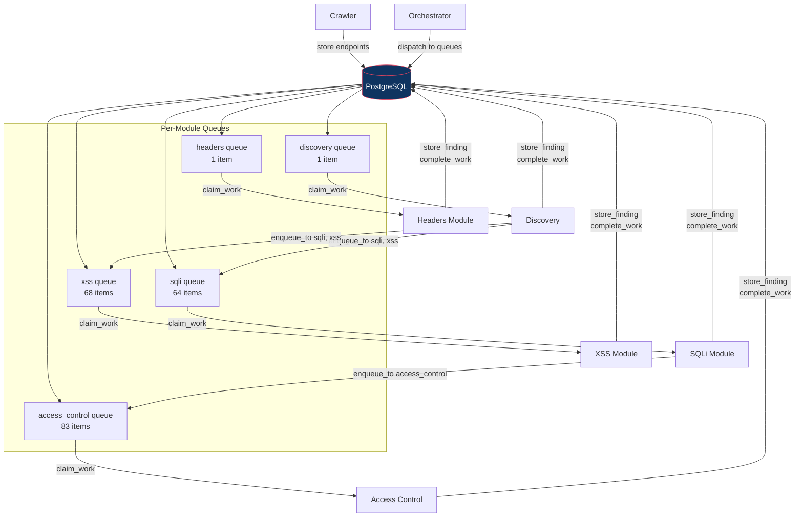

### Schema

```sql
scans
  id, target, engagement_id, status
  admin_token, user_token, user_id   -- shared auth
  started_at, completed_at

endpoints
  scan_id, url, method, parameters (JSON), content_type
  UNIQUE(scan_id, url, method)

endpoint_agent_status                -- junction table (no comma-separated strings)
  endpoint_id, agent_name            -- composite PK
  status (pending/tested/skipped)
  tested_at, finding_count

scan_queue                           -- per-module work queues
  scan_id, target_module, source_module
  url, method                        -- common across all modules
  payload (JSONB)                    -- module-specific extras
  dedup_key                          -- module determines this
  status (pending/claimed/completed)
  UNIQUE(scan_id, target_module, dedup_key)

findings
  scan_id, module, vuln_type, severity
  title, description, endpoint_url, evidence
  payload_used, cwe_id, confirmed

token_usage                          -- LLM cost tracking per module
  scan_id, module
  input_tokens, output_tokens, calls
```

### Queue Dispatch

The orchestrator routes crawled endpoints to module queues based on relevance:

| Module | Gets | Dedup Key |
|--------|------|-----------|
| sqli, sqli_agent | Parameterized endpoints (one item per param) + login endpoints | `method\|url\|param_name` |
| xss, xss_agent | Parameterized (per param) + POST endpoints | `method\|url\|param_name` |
| access_control | All endpoints (IDOR can be anywhere) | `method\|url` |
| discovery, discovery_agent | Base URL only (discovers its own paths) | `method\|url` |
| headers | Base URL only | `method\|url` |
| ssrf | Endpoints with URL-like params | `method\|url` |
| info_disclosure | All endpoints | `method\|url` |

### Cross-Module Dispatch

Any module can enqueue work to any other module's queue:

```python
# SQLi finds injection → tells access_control to check for IDOR
self.enqueue_to("access_control", url, method,
    payload={"related_finding": "SQLi found here"})

# Discovery finds /ftp → tells sqli and xss to test it
self.enqueue_to("sqli_agent", "/ftp/backup.sql", "GET",
    payload={"reason": "backup file in FTP"})
```

### Token Usage Tracking

Every LLM call is tracked per module via LangChain callbacks:

```
Token Usage:
  access_control            in=  45,000 out= 12,000 calls=25
  sqli_agent                in=  38,000 out=  8,500 calls=20
  discovery_agent           in=  22,000 out=  5,200 calls=15
  xss_agent                 in=  18,000 out=  4,100 calls=12
  TOTAL                     in= 123,000 out= 29,800 calls=72
```

Persisted to `token_usage` table for cost analysis across engagements.

---

## Component Architecture

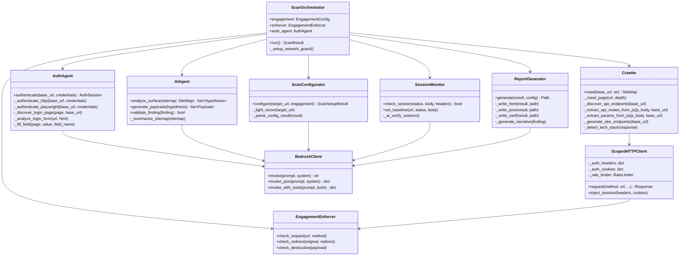

---

## Data Flow

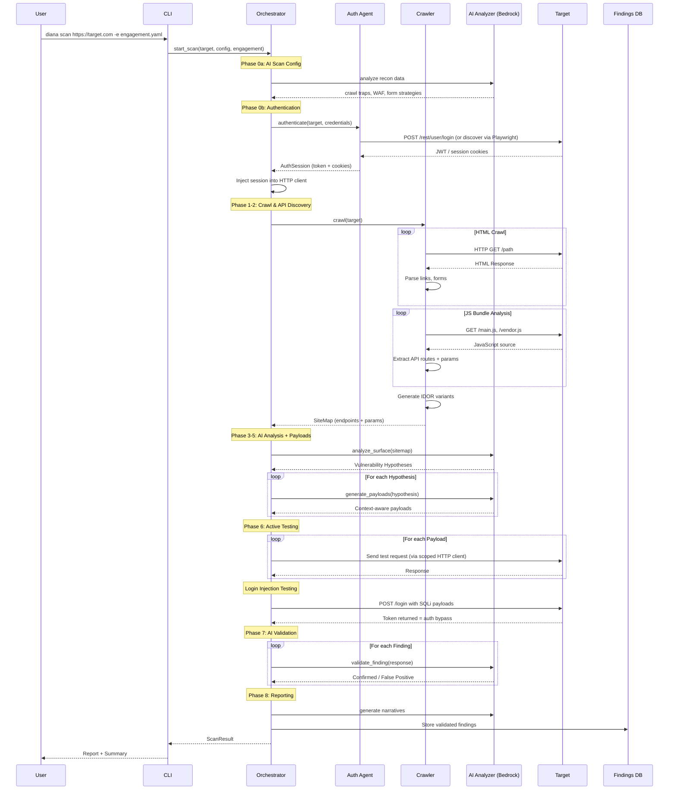

---

## Vulnerability Detection Modules

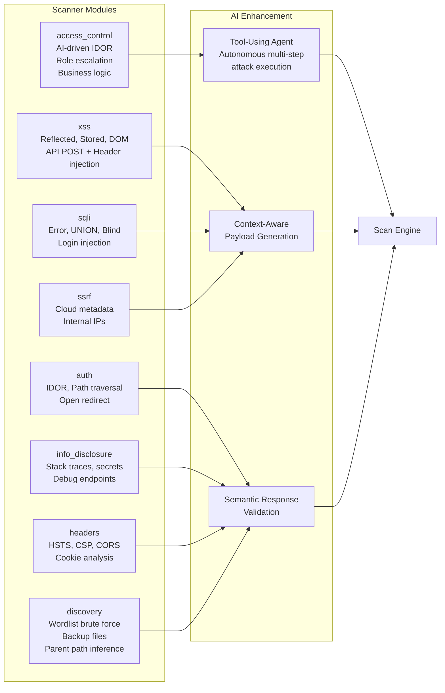

### Scanner Modules (11 total)

**AI Agent Modules** — LangGraph ReAct agents with HTTP tools, pull endpoints from DB in batches:

| Module | What It Tests | How It Works |
|--------|--------------|-------------|
| **access_control** | IDOR, role escalation, CAPTCHA bypass, business logic | Registers low-priv user, tests with both auth levels, reasons about multi-step flows |
| **sqli_agent** | SQLi, NoSQL, SSTI, command injection | Targets parameterized endpoints, tries error/UNION/blind, escalates based on responses |
| **xss_agent** | Reflected/stored XSS, filter bypass, header injection | Sends canary, checks reflection, adapts payloads to bypass filters |
| **discovery_agent** | Hidden paths, backup files, exposed configs | Reads robots.txt as attack intel, follows breadcrumbs, explores directory listings |

**Static Modules** — deterministic payloads and pattern matching, no LLM calls:

| Module | What It Tests |
|--------|--------------|
| **sqli** | UNION payloads, error-based, login auth bypass |
| **xss** | Static payloads + DOM XSS via Playwright |
| **ssrf** | Cloud metadata endpoints, internal IPs |
| **auth** | IDOR by ID, path traversal, open redirect |
| **headers** | HSTS, CSP, CORS, cookies |
| **info_disclosure** | Secrets, stack traces, debug endpoints |
| **discovery** | Wordlist brute force, backup extensions, SPA-aware 404 filtering |

---

## Technology Stack

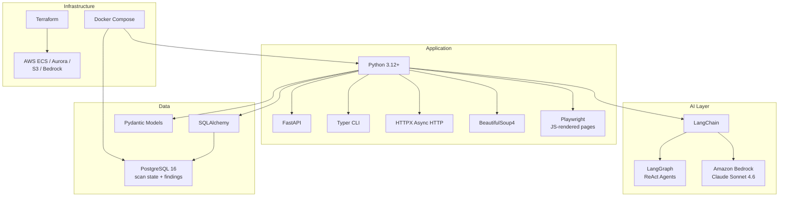

### Provider Abstraction

```python
# llm.py — change one function to swap LLM provider
def create_llm() -> BaseChatModel:
    return ChatBedrockConverse(model="us.anthropic.claude-sonnet-4-6", ...)
    # or: return ChatOllama(model="mistral-nemo", ...)
    # or: return ChatHuggingFace(model_id="...", ...)
```

All agents, prompts, and tools use LangChain's `BaseChatModel` interface — provider-agnostic.

---

## Project Structure

```
web-scanner/
├── docs/
│   ├── ARCHITECTURE.md          # This file
│   ├── GETTING_STARTED.md       # Setup and usage guide
│   ├── SCAN_RESULTS.md          # Juice Shop coverage matrix
│   └── API.md                   # REST API reference
├── tf/
│   ├── modules/
│   │   ├── networking/          # VPC, subnets, 5 security groups, VPC endpoints
│   │   ├── ecs/                 # Fargate cluster, ALB, scanner service, auto-scaling
│   │   ├── test_targets/        # Juice Shop, DVWA, WebGoat + Cloud Map discovery
│   │   ├── database/            # Aurora Serverless v2 PostgreSQL
│   │   ├── storage/             # S3 reports, ElastiCache Redis, Secrets Manager, CloudWatch
│   │   ├── dns/                 # ACM cert + Route 53 alias for your domain
│   │   └── iam/                 # Execution role, scanner role (Bedrock+S3), target role (none)
│   └── environments/
│       └── dev/                 # Wires all modules, S3 backend state
├── engagements/
│   ├── local-juiceshop.yaml     # Local dev (with credentials)
│   ├── test-juiceshop.yaml      # Docker/ECS test engagement
│   ├── test-dvwa.yaml
│   └── test-webgoat.yaml
├── docker-compose.yaml          # Scanner API
├── docker-compose.dev.yaml      # PostgreSQL + test targets exposed to localhost
├── docker-compose.targets.yaml  # Test range (isolated internal network)
├── src/
│   └── diana/
│       ├── __init__.py
│       ├── cli.py               # Typer CLI (.env loading, --local, --no-ai)
│       ├── api.py               # FastAPI REST API (X-API-Key auth)
│       ├── config.py            # Configuration (DIANA_AI_ENABLED, database_url)
│       ├── engagement/
│       │   ├── models.py        # Engagement, scope, credentials config
│       │   ├── enforcer.py      # Scope enforcement (L2)
│       │   ├── dns_guard.py     # Whitelisted DNS resolver (L3)
│       │   ├── net_guard.py     # Egress iptables/SG generator (L4)
│       │   └── audit.py         # Append-only JSONL audit log
│       ├── core/
│       │   ├── orchestrator.py  # Scan pipeline (auth -> crawl -> DB -> agents -> validate)
│       │   ├── crawler.py       # HTML spider + JS API discovery + IDOR generation
│       │   ├── spa_crawler.py   # Playwright SPA route discovery + DOM XSS
│       │   ├── http_client.py   # Scoped HTTP client (auth injection, rate limiting)
│       │   ├── state.py         # PostgreSQL scan state manager (endpoints, findings)
│       │   └── models.py        # Pydantic data models
│       ├── ai/
│       │   ├── llm.py           # LangChain LLM provider (swap Bedrock/Ollama/HF here)
│       │   ├── tool_agent.py    # LangGraph ReAct agent loop (shared by all AI agents)
│       │   ├── agent.py         # Surface analysis, payload gen, validation (Bedrock direct)
│       │   ├── auth_agent.py    # Auth agent (HTTP API + Playwright login)
│       │   ├── bedrock.py       # Raw Bedrock client (used by non-agent AI calls)
│       │   ├── configurator.py  # AI scan setup (crawl traps, WAF, forms)
│       │   ├── session_monitor.py # Mid-scan session health
│       │   └── prompts.py       # Prompt templates (scope injected as L1)
│       ├── scanners/
│       │   ├── base.py          # Base scanner (scan_state + scan_id fields)
│       │   ├── access_control.py # AI agent: IDOR, role escalation, business logic
│       │   ├── sqli_agent.py    # AI agent: SQLi, NoSQL, SSTI, cmd injection
│       │   ├── xss_agent.py     # AI agent: reflected/stored XSS, filter bypass
│       │   ├── discovery_agent.py # AI agent: hidden paths, robots.txt as attack intel
│       │   ├── xss.py           # Static: XSS payloads + DOM XSS via Playwright
│       │   ├── sqli.py          # Static: SQLi payloads + login injection
│       │   ├── ssrf.py          # Static: cloud metadata, internal IPs
│       │   ├── auth.py          # Static: IDOR by ID, path traversal, open redirect
│       │   ├── headers.py       # Static: security headers, CORS, cookies
│       │   ├── info_disclosure.py # Static: secrets, stack traces, debug endpoints
│       │   ├── discovery.py     # Static: wordlist brute force, backup extensions
│       │   └── registry.py      # 11 modules registered
│       ├── payloads/
│       ├── validation/
│       └── reporting/
│           └── reporter.py      # HTML (dark theme), JSON, SARIF output
├── tests/
│   ├── unit/
│   └── integration/
├── .env                         # Local config (gitignored) — API key, AI toggle, DB URL
├── pyproject.toml               # deps: langchain, langchain-aws, langgraph, psycopg2, etc.
├── Dockerfile
└── README.md
```

---

## Deployment Architecture

### Local Mode

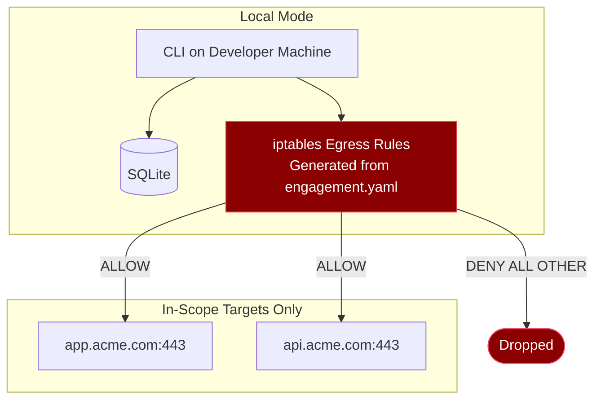

### Cloud Mode

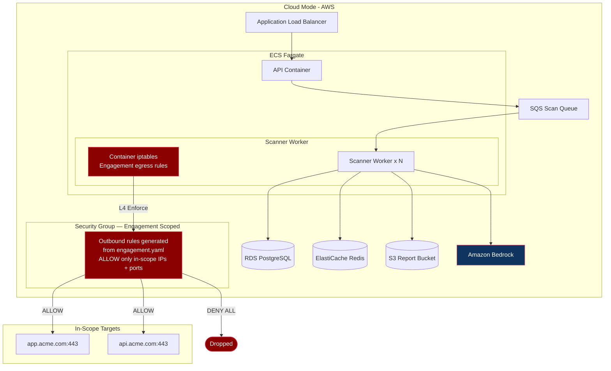

---

## Test Target Infrastructure

Diana ships with a built-in **test range** — a set of intentionally vulnerable web applications used to validate scanner accuracy, train the AI, and demonstrate capabilities. These targets are deployed alongside the scanner but are **completely isolated** — accessible only from the scanner itself.

### Test Applications

| Application | Stack | Port | Purpose |
|------------|-------|------|---------|
| **OWASP Juice Shop** | Angular + Node.js/Express | 3000 | Modern SPA with REST API — tests AI crawling of client-side routing, API endpoint discovery, realistic app behavior |
| **DVWA** | PHP / MySQL | 80 | Classic injection vulns with tunable difficulty (Low/Med/High/Impossible) — validates payload generation and false positive rejection |
| **WebGoat** | Java / Spring Boot | 8080 | Java-specific vulns, auth/session challenges — tests session monitoring and auth flow detection |

### Network Isolation

The test targets exist in a **locked-down security group** that permits inbound traffic **only from the scanner's security group**. No public access, no other internal access. The scanner is the only thing that can talk to them.

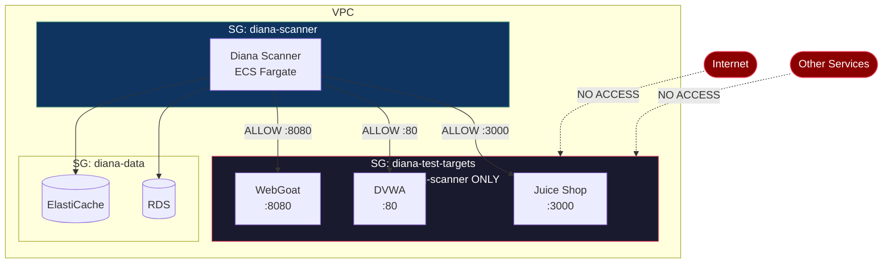

### Security Group Rules

```
# sg-diana-test-targets
Inbound:
  - Source: sg-diana-scanner, Port: 80,   Protocol: TCP   # DVWA
  - Source: sg-diana-scanner, Port: 3000, Protocol: TCP   # Juice Shop
  - Source: sg-diana-scanner, Port: 8080, Protocol: TCP   # WebGoat
  (no other inbound rules)

Outbound:
  - Destination: 0.0.0.0/0, Port: 443, Protocol: TCP     # DVWA MySQL init / Juice Shop npm (build only)
  (locked down after container start)

# sg-diana-scanner
Outbound:
  - Destination: sg-diana-test-targets, Ports: 80,3000,8080  # Test targets
  - Destination: Bedrock VPC Endpoint, Port: 443              # AI
  - Destination: engagement-scoped IPs (dynamic)              # Real targets
```

### Local Development (Docker Compose)

For local development, the test targets run as Docker containers on an **isolated Docker network**. Only the scanner container can reach them — they have no port bindings to the host.

```mermaid
graph LR
    subgraph Host Machine
        CLI[diana CLI]
    end

    subgraph docker-network: diana-internal
        Scanner[diana-scanner]
        JuiceShop[juice-shop:3000]
        DVWA[dvwa:80]
        WebGoat[webgoat:8080]
    end

    CLI -->|localhost:8000| Scanner
    Scanner --> JuiceShop
    Scanner --> DVWA
    Scanner --> WebGoat

    JuiceShop -.->|no host port binding| Host Machine
    DVWA -.->|no host port binding| Host Machine
    WebGoat -.->|no host port binding| Host Machine

    style JuiceShop fill:#1a1a2e,stroke:#e94560,color:#fff
    style DVWA fill:#1a1a2e,stroke:#e94560,color:#fff
    style WebGoat fill:#1a1a2e,stroke:#e94560,color:#fff
```

### Docker Compose (Test Range)

```yaml
# docker-compose.targets.yaml
services:
  juice-shop:
    image: bkimminich/juice-shop:latest
    networks:
      - diana-internal
    # NO ports: section — not exposed to host

  dvwa:
    image: vulnerables/web-dvwa:latest
    networks:
      - diana-internal
    environment:
      - MYSQL_DATABASE=dvwa

  webgoat:
    image: webgoat/webgoat:latest
    networks:
      - diana-internal

  diana-scanner:
    build: .
    ports:
      - "8000:8000"  # API only exposed to host
    networks:
      - diana-internal
    volumes:
      - ./engagements:/app/engagements
    environment:
      - AWS_REGION=us-east-1

networks:
  diana-internal:
    driver: bridge
    internal: true  # No external connectivity for this network
```

### Test Engagement File

Each test target gets a pre-built engagement file so Diana's scope enforcement is exercised even during testing:

```yaml
# engagements/test-juiceshop.yaml
engagement:
  id: "TEST-JUICESHOP-001"
  client: "Internal Testing"
  start_date: "2026-01-01T00:00:00Z"
  end_date: "2099-12-31T23:59:59Z"
  tester: "diana-ci"

scope:
  targets:
    - domain: "juice-shop"       # Docker service name
      ports: [3000]
      paths:
        include: ["/*"]
        exclude: []
      methods: [GET, POST, PUT, DELETE]

  deny_list: []

restrictions:
  rate_limit: 50
  max_concurrent: 10
  destructive_payloads: false
  max_crawl_depth: 5
```

### Validation Matrix

The test targets serve as a **known-answer test** for the scanner. We know exactly what vulns each app contains, so we can measure:

| Metric | What It Measures |
|--------|-----------------|
| **True Positive Rate** | Did Diana find the known vulns? |
| **False Positive Rate** | Did Diana report vulns that don't exist? |
| **False Negative Rate** | What known vulns did Diana miss? |
| **AI vs Traditional** | Run with `--no-ai` flag and compare — quantifies the AI's value-add |
| **Payload Quality** | Did AI-generated payloads succeed where static ones failed? |

---

## Security & Ethical Considerations

### Defense in Depth — Engagement Enforcement

Diana treats the engagement configuration as a **security boundary**, not a suggestion. Scope is enforced at four independent layers so that no single bug or bypass can result in out-of-scope traffic:

1. **AI Prompt Constraints (L1)** — the engagement scope is injected into every LLM system prompt as immutable context
2. **Application Scope Enforcer (L2)** — wraps the HTTP client; validates every URL against the engagement whitelist
3. **DNS Resolution Guard (L3)** — custom resolver only resolves whitelisted domains; blocks DNS rebinding
4. **Network Egress Whitelist (L4)** — iptables (local) or Security Groups (AWS) restrict outbound to in-scope IPs only

### Additional Safeguards

- **Engagement time windows** — scans automatically pause/resume based on approved hours
- **Rate governing** — configurable throttling with backpressure, not just delays
- **Non-destructive by default** — destructive payloads require explicit `destructive_payloads: true`
- **Full audit trail** — every request (allowed and blocked) logged with timestamp, target, and decision reason
- **Redirect scope checking** — redirects to out-of-scope hosts are not followed
- **Engagement expiry** — scans cannot start or continue after the engagement end date

---

## What Makes This Different

| Feature | Traditional Scanners | Diana |
|---------|---------------------|---------|
| **Architecture** | Monolithic — every check runs on every URL | Queue-based — each module has its own work queue, any module can enqueue to any other |
| **Module coordination** | None — modules run independently | Cross-module dispatch — SQLi finding triggers access control check on same endpoint |
| **AI integration** | None or bolt-on | Tool-using LangGraph agents reason about multi-step attacks autonomously |
| **Attack chaining** | Manual | Graph of thought — agents see each other's findings, iterate, chain attacks |
| **Scan setup** | Hours of manual config | AI auto-discovers login flows, crawl traps, form strategies |
| **Authentication** | Manual macro recording | Auth agent discovers and executes login (HTTP API + Playwright) |
| **SPA support** | Blind to JS-rendered apps | JS bundle analysis + Playwright route discovery + DOM XSS testing |
| **False positive rate** | High (pattern matching) | Low (AI semantic validation) |
| **Scope enforcement** | Single layer config | Defense in depth: L1 prompts + L2 enforcer + L3 DNS + L4 network |
| **Cost tracking** | None | Per-module token usage tracked in DB per scan |
| **Provider lock-in** | Vendor-specific | LangChain abstraction — swap Bedrock/DeepSeek/Ollama in one line |
| **Scaling** | Single process | Queue-based — ready for Lambda fan-out, multiple workers on same queue |
| **Learning** | Static rules | Agent router design — cross-engagement learning on agent success rates (planned) |
