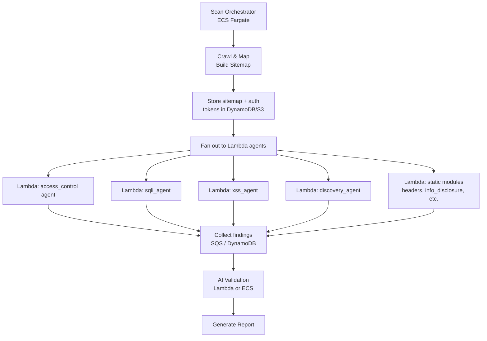

# Diana — Future Roadmap

## Current State (v0.1.0)

- 11 scanner modules (7 static, 4 AI agent-driven)
- AI tool-using agents for access control, SQLi, XSS, and discovery
- Auth agent with auto-login (HTTP API + Playwright)
- SPA crawling via Playwright + JS route extraction
- Defense-in-depth engagement scope enforcement (L1-L4)
- Deployed on AWS (ECS Fargate, Aurora, ElastiCache, Bedrock)
- Test range: Juice Shop, DVWA, WebGoat (isolated security groups)

---

## Near-Term: Parallel Scanning with Lambda

### Problem

Each AI agent runs sequentially — access_control finishes, then sqli_agent, then xss_agent, then discovery_agent. A full AI scan takes 30-60 minutes because each agent makes 20-30 Bedrock calls serially.

### Architecture: Lambda Fan-Out



### How It Works

1. **Orchestrator (ECS)** runs the crawl, builds the sitemap, authenticates, stores state in DynamoDB
2. **Fan-out** invokes one Lambda per scanner module — all run in parallel
3. Each Lambda gets: sitemap reference, auth tokens (from Secrets Manager), engagement config
4. Each Lambda runs its agent loop independently, writes findings to DynamoDB
5. **Collector** waits for all Lambdas to complete, runs AI validation on combined findings
6. **Reporter** generates the final report

### Benefits

| Current | Lambda Fan-Out |
|---------|---------------|
| Sequential: 30-60 min for 4 agents | Parallel: ~15 min (longest agent) |
| Single ECS task, all modules in-process | Each module isolated, independent scaling |
| One Bedrock throttle budget | Each Lambda has its own Bedrock session |
| Scan dies if ECS task crashes | Individual Lambda failure doesn't kill scan |

### Implementation

```
tf/modules/lambda/
├── main.tf              # Lambda functions per scanner module
├── iam.tf               # Execution role with Bedrock + DynamoDB access
├── variables.tf
└── outputs.tf

src/diana/
├── lambda_handler.py    # Lambda entry point — receives module name + scan config
├── core/
│   └── state.py         # DynamoDB state manager (sitemap, findings, tokens)
```

### Lambda Configuration

| Setting | Value | Why |
|---------|-------|-----|
| Runtime | Python 3.12 | Match ECS |
| Memory | 512 MB | Enough for httpx + agent loop |
| Timeout | 15 min | Max Lambda timeout, matches agent turn count |
| Concurrency | 4-6 per scan | One per module, reserved concurrency |
| VPC | Same VPC as ECS | Access test targets via security groups |
| Layers | boto3, httpx, beautifulsoup4 | Shared dependencies |

### Cost Impact

Lambda: ~$0.001 per scan per module (15 min × 512 MB = ~$0.006 total for 6 Lambdas)
vs. ECS: already running 24/7 ($36/mo)

Lambda is cheaper for on-demand scanning. ECS stays for the API server.

---

## Near-Term: Database-Backed Scan State

### Problem

All scan state (endpoints, findings, agent context) lives in memory. This means:
- AI agents get the full endpoint list in their prompt (context bloat → hallucinations)
- Can't scale horizontally (workers can't share state)
- Can't resume interrupted scans

### Solution

Move scan state to SQLite (local) / DynamoDB (Lambda) / Aurora (ECS):

```python
class ScanState:
    """Persistent scan state — replaces in-memory sets and lists."""

    async def store_endpoint(self, scan_id: str, endpoint: Endpoint) -> None
    async def get_untested_endpoints(self, scan_id: str, module: str, limit: int) -> list[Endpoint]
    async def mark_tested(self, scan_id: str, endpoint_url: str, module: str) -> None
    async def store_finding(self, scan_id: str, finding: Finding) -> None
    async def get_findings(self, scan_id: str) -> list[Finding]
    async def is_url_visited(self, scan_id: str, url: str) -> bool
```

### Agent Context Reduction

Instead of dumping 50 endpoints into the agent prompt:
```
# Before: full endpoint list in prompt (token-heavy, hallucination risk)
endpoints_summary = "\n".join(all_50_endpoints)

# After: batch of 10 untested endpoints from DB
batch = await state.get_untested_endpoints(scan_id, "sqli_agent", limit=10)
```

Agent processes a batch, marks them tested, gets next batch. Keeps context small and focused.

---

## Medium-Term: Improvements

### File Upload Testing Module
- Detect file upload endpoints (multipart form, drag-drop zones)
- Test type bypass (double extension, null byte, content-type mismatch)
- XXE via XML upload
- Path traversal in filenames
- Applicable to any app with file uploads

### JWT Analysis Module
- Decode and inspect JWT tokens captured by auth agent
- Test for unsigned tokens (alg: none)
- Test for weak signing keys (brute force HS256)
- Check expiration and claim validation
- Detect JWK/JWKS misconfigurations

### Password Reset Flow Testing
- AI agent reasons about forgot-password flows
- Enumerate security questions
- Test for account enumeration via reset responses
- Check for token predictability in reset links

### GraphQL Introspection
- Detect GraphQL endpoints
- Run introspection query to map full schema
- Test each query/mutation for auth bypass
- Batch query abuse for DoS

---

## Long-Term: Platform

### Multi-Target Engagement
- One engagement file, multiple targets
- Shared findings database across targets
- Cross-target correlation (same vuln on multiple services)

### CI/CD Integration
- GitHub Action that runs Diana on PRs
- SARIF output → GitHub Security tab
- Block merge on critical findings
- Incremental scans (only test changed endpoints)

### Scan Scheduling
- Cron-based recurring scans via EventBridge
- Diff reports (new findings since last scan)
- Alert on regression (previously-fixed vuln reappears)

### Agent Memory Across Scans
- Store agent observations in vector DB
- "Last time I scanned this app, UNION with 9 columns worked on search"
- Reduces redundant probing, faster subsequent scans
- RAG-based context for the AI agents

### Collaborative Scanning
- Multiple Diana instances coordinate via shared state
- One discovers, another tests, another validates
- Swarm-style autonomous pentesting
